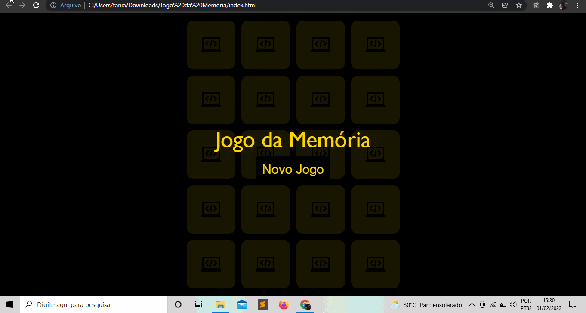

### - Para testar as skills que venho adquirindo ao longo do curso ProgramadorBR, tive a ideia de fazer o jogo da Memória. O jogo funciona convencionalmente como o real e pode ser jogado quantas vezes quiser.
### - Este projeto me desafiou bastante, pois tive que criar a interação das cartas e também a interatividedade de ao iniciar desvirarem e virarem, também adicionar som e deixar eas viradas quando uma é igual a outra.

### - Nesta aplicação foram usados as seguintes tecnologias:

#### *HTML.
#### *CSS.
#### *Java Script

### Demonstração da aplicação

### Para acessar meu projeto e testar você mesmo, não é necessário subir serviços ou realizar build, pois o mesmo está hospedado no seguinte link: https://kif1.github.io/Pagina-de-captura/
### Repositório: https://github.com/KiF1

### Gostou do meu projeto? :D Entre em contato comigo! 
[Linkedin](https://www.linkedin.com/in/abner-santos-b195b8228/)  
[Email: abner.kif1@gmail.com](mailto:abner.kif1@gmail.com)

